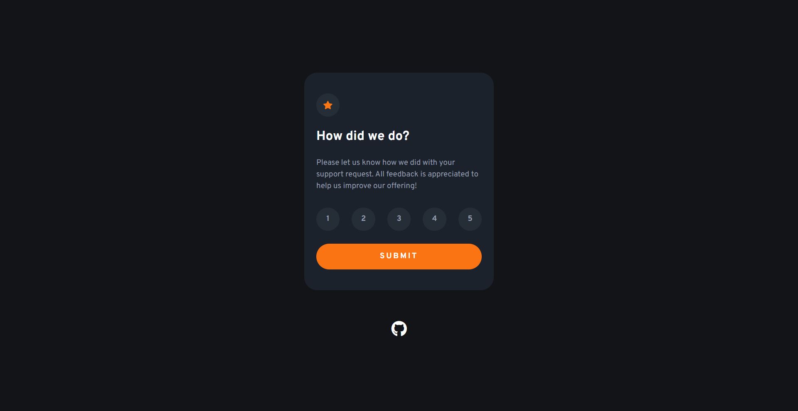

# Interactive Rating Component

## Links
- [Challenge Link](https://www.frontendmentor.io/challenges/interactive-rating-component-koxpeBUmI)
- [Site Preview](https://robinjmm-rating-component.vercel.app/)

## About
This is my solution for Rating Component challenge from [Frontendmentor.io](https://www.frontendmentor.io).

## User Stories
The user should be able to:
- Select and submit a number rating
- See the "Thank you" card state after submitting a rating
- View the optimal layout for the app depending on their device's screen size
- See hover states for all interactive elements on the page

## Built With
- HTML5
- CSS3
- Sass
- PostCSS
- JavaScript
- Vite

## Acknowledgement
I'm very grateful to the people at [Frontendmentor.io](https://frontendmentor.io) for providing designs and challenges that help me improve my skills as a web developer.